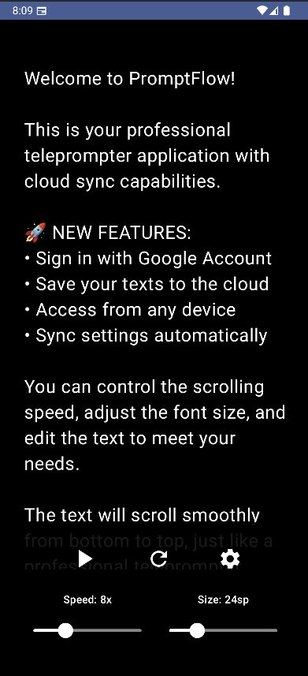
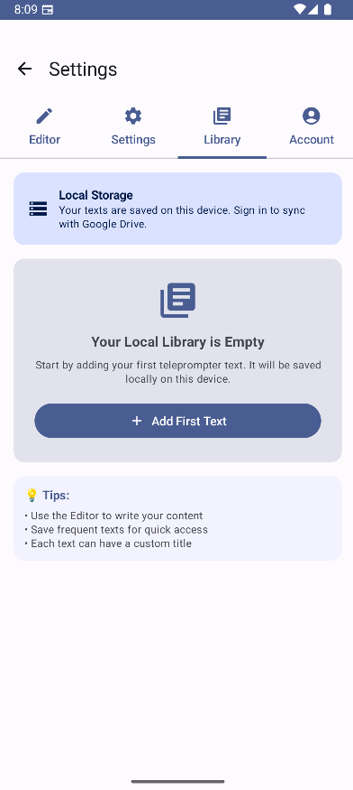

# PromptFlow 📱

> **Professional Android Teleprompter with Cloud Sync**

A modern, feature-rich teleprompter application for Android with Google Sign-In integration and cloud synchronization capabilities. **Now supports both landscape and portrait orientations with adaptive layouts optimized for tablets and phones. December 2024 update includes major horizontal layout optimizations.**

## 📱 Screenshots & Demo

Overview of the PromptFlow user interface on different devices and orientations:

<table>
  <tr>
    <td align="center">
      
      <br><sub><em>Eg: Main teleprompter screen</em></sub>
    </td>
    <td align="center">
      
      <br><sub><em>Eg: Google integration</em></sub>
    </td>
  </tr>
  <tr>
    <td align="center">
      
      <br><sub><em>Eg: Text library</em></sub>
    </td>
    <td align="center">
      
      <br><sub><em>Eg: Text editor</em></sub>
    </td>
  </tr>
</table>

## ✨ Features

### 🎬 **Core Teleprompter**
- **Smooth Auto-Scroll**: Variable speed control (1x-25x)
- **Adjustable Font Size**: 16sp to 48sp for optimal readability
- **Professional Controls**: Play/pause, reset, speed adjustment
- **Adaptive Orientation**: Works seamlessly in both landscape and portrait modes
- **Tablet Optimized**: Side controls in portrait mode for better tablet experience
- **Phone Friendly**: Bottom controls for easy one-handed operation

### 📱 **Multi-Orientation Support (Optimized December 2024)**
- **Landscape Mode**: Traditional teleprompter experience with bottom controls
- **Portrait Mode**: Optimized for tablets with side control panel
- **Automatic Detection**: Adapts layout based on device size and orientation
- **Responsive Design**: Different layouts for phones vs tablets
- **Accessibility Focus**: Controls positioned for comfortable usage in any orientation
- **Horizontal Layout Optimizations**:
  - Compact TopAppBar (48dp) for more content space
  - Optimized side navigation with proper text sizing
  - Eliminated excessive padding and white space
  - Two-column layouts in settings for better space utilization

### 📚 **Text Library Management**
- **Local Storage**: Save texts locally when not signed in
- **Google Drive Integration**: Cloud storage and sync across devices *(UI ready, API implementation pending)*
- **Easy Text Management**: Create, select, and delete saved texts
- **Automatic Migration**: Local texts migrate to cloud when signing in

### 🔐 **Authentication & Sync**
- **Google Sign-In**: Secure authentication with Firebase
- **Cross-Device Sync**: Access your texts from any device *(planned)*
- **Offline-First**: Works perfectly without internet connection
- **Smart Migration**: Seamless transition from local to cloud storage

### 🎨 **Modern UI/UX**
- **Material Design 3**: Beautiful, adaptive interface
- **Dark Theme**: Professional teleprompter appearance
- **Adaptive Layouts**: Different interfaces for tablets and phones
- **Intuitive Navigation**: Tab-based interface with NavigationRail for tablets
- **Error Handling**: User-friendly error messages with recovery options
- **Text Overflow Handling**: Smart text truncation with ellipsis for long labels
- **Responsive Text Sizing**: Automatic font scaling for different screen densities

## 📱 Device Support

### **Phone (Any Orientation)**
- **Portrait**: Traditional tab layout with bottom teleprompter controls
- **Landscape**: Full-screen teleprompter experience with overlay controls

### **Tablet Portrait**
- **Teleprompter**: Side control panel for easy access without blocking text
- **Settings**: NavigationRail for efficient navigation
- **Text Editor**: Larger text area with improved line spacing

### **Tablet Landscape (Major Optimizations December 2024)**
- **Compact Interface**: 48dp TopAppBar vs standard 56dp for more content space
- **Optimized Side Navigation**: 140dp width with proper text handling (maxLines=2, ellipsis overflow)
- **Efficient Padding**: Reduced excessive spacing for better content area utilization
- **Two-Column Settings**: Speed and font size controls side-by-side for better space usage
- **Grid Library Layout**: Two-column grid for text library in horizontal mode

## 🚀 Quick Start

### Installation
1. Clone the repository
```bash
git clone https://github.com/ColinBurgess/PromptFlow.git
cd PromptFlow
```

2. Open in Android Studio
3. Sync Gradle dependencies
4. Run on device or emulator with Google Play Services

### Usage
1. **Without Sign-In**: Start using immediately with local text storage
2. **With Google Account**: Sign in for cloud sync and cross-device access
3. **Create Texts**: Use the Text Editor tab to write your scripts
4. **Save & Organize**: Build your personal teleprompter library
5. **Present**: Select any saved text and start teleprompter mode
6. **Rotate Device**: App automatically adapts to your preferred orientation

## 🛠️ Technical Stack

- **Language**: Kotlin 100%
- **UI Framework**: Jetpack Compose + Material Design 3
- **Architecture**: MVVM with StateFlow
- **Authentication**: Firebase Auth + Google Sign-In
- **Local Storage**: SharedPreferences + Gson
- **Cloud Storage**: Google Drive (in development)
- **Navigation**: Navigation Compose + NavigationRail
- **Responsive Design**: Adaptive layouts for different screen sizes
- **Min SDK**: 24 (Android 7.0)
- **Target SDK**: 34 (Android 14)

## 📱 Orientation & Layout Features

### **Automatic Orientation Detection**
- Detects device orientation and screen size automatically
- Switches between layouts seamlessly
- Maintains user preferences and state across rotations

### **Tablet Portrait Optimizations**
- **Side Control Panel**: Controls positioned on the right side for easy thumb access
- **Larger Text Area**: More screen real estate for teleprompter text
- **NavigationRail**: Efficient vertical navigation for settings
- **Improved Typography**: Better line spacing and font sizing for tablets

### **Responsive Control Positioning**
- **Landscape**: Controls at bottom, auto-hide during playback
- **Portrait Tablet**: Side panel with vertical layout
- **Portrait Phone**: Traditional bottom controls


## 🔧 Development Setup

### Prerequisites
- Android Studio Arctic Fox or newer
- JDK 11 or higher
- Android SDK 34
- Google Play Services enabled device/emulator

### Configuration Changes
The app now supports orientation changes with `android:configChanges="orientation|screenSize|keyboardHidden"` in the manifest, ensuring smooth transitions between orientations without activity recreation.

### Firebase Configuration
1. Create Firebase project at [Firebase Console](https://console.firebase.google.com/)
2. Add Android app with package `com.promptflow.android`
3. Download `google-services.json` to `app/` directory
4. Enable Authentication → Google provider
5. Configure SHA-1 fingerprint:
```bash
./gradlew signingReport
```

### Build Commands
```bash
# Debug build
./gradlew assembleDebug

# Release build
./gradlew assembleRelease

# Run tests
./gradlew test

# Install on connected device
./gradlew installDebug
```

## 🎯 Roadmap

### ✅ v1.1.0 (Current)
- [x] **Multi-orientation support** with adaptive layouts
- [x] **Tablet optimization** with side controls and NavigationRail
- [x] **Responsive design** for different screen sizes
- [x] **Improved Spanish localization** for interface elements
- [x] **Enhanced teleprompter controls** with better positioning

### 🚧 v1.2.0 (Next Release)
- [ ] **Real Google Drive API integration**
- [ ] **Edit existing texts functionality**
- [ ] **Search and filter in library**
- [ ] **Text sharing capabilities**
- [ ] **Advanced teleprompter settings**
- [ ] **Vertical slider controls** for tablet portrait mode

### 🔮 v2.0.0 (Future)
- [ ] **Real-time sync across devices**
- [ ] **Collaborative text editing**
- [ ] **Remote control via companion app**
- [ ] **Advanced presentation features**
- [ ] **Analytics and reading metrics**
- [ ] **Custom themes and layouts**

## 🐛 Known Issues

### Current Limitations
- **Google Drive**: UI shows "Google Drive" but files are currently stored locally
- **Text Editing**: Can only create new texts, editing existing ones pending
- **Device Sync**: Real-time synchronization not yet implemented
- **Vertical Sliders**: Portrait tablet controls use horizontal sliders (custom implementation needed)

### Workarounds
- All functionality works perfectly with local storage
- Texts "migrate" to cloud state when signing in (UI simulation)
- Manual refresh required when switching between devices
- Rotate device for different control layouts

## 📱 Device Compatibility

### **Tested Orientations**
- ✅ Phone Portrait: Bottom tabs and controls
- ✅ Phone Landscape: Full-screen teleprompter
- ✅ Tablet Portrait: Side control panel
- ✅ Tablet Landscape: NavigationRail layout

### **Screen Size Support**
- **Small (< 600dp)**: Phone layout with bottom controls
- **Medium (600-840dp)**: Tablet layout with adaptive controls
- **Large (> 840dp)**: Full tablet experience with side panels

## 🤝 Contributing

We welcome contributions! Please see our contribution guidelines:

1. **Fork** the repository
2. **Create** a feature branch (`git checkout -b feature/amazing-feature`)
3. **Commit** your changes (`git commit -m 'Add amazing feature'`)
4. **Push** to the branch (`git push origin feature/amazing-feature`)
5. **Open** a Pull Request

### Code Standards
- **Language**: All code, comments, and documentation in English
- **Architecture**: Follow MVVM pattern with Compose
- **Responsive Design**: Consider both phone and tablet layouts
- **Orientation Support**: Test in both portrait and landscape
- **Style**: Android Kotlin Style Guide
- **Testing**: Include unit tests for new features

## 📄 License

This project is licensed under the MIT License - see the [LICENSE](LICENSE) file for details.

## 👨‍💻 Author

**Colin Moreno-Burgess** ([@ColinBurgess](https://github.com/ColinBurgess))

## 🙏 Acknowledgments

- **Firebase Team** for authentication services
- **Google Material Design** for UI components and responsive design patterns
- **Jetpack Compose Team** for modern Android UI toolkit with adaptive layouts
- **Android Developer Community** for best practices in multi-orientation support

---

### 📊 Project Status


**Active Development** | **Multi-Orientation Ready** | **Tablet Optimized** | **Cloud Integration In Progress**